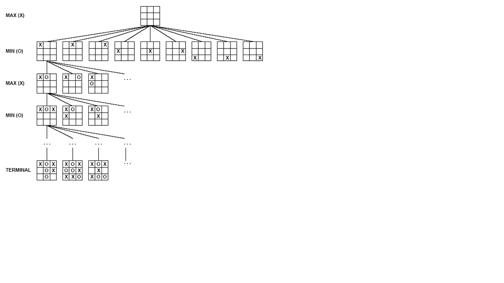
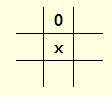
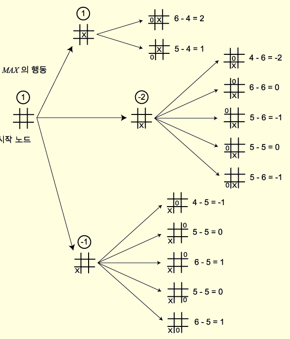
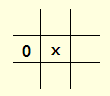
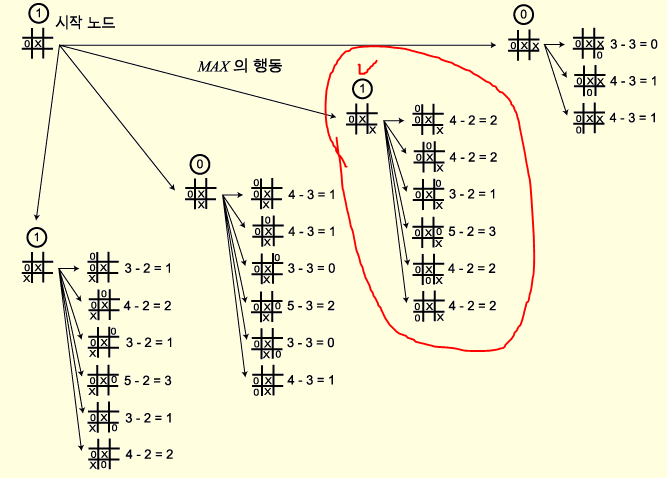
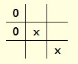
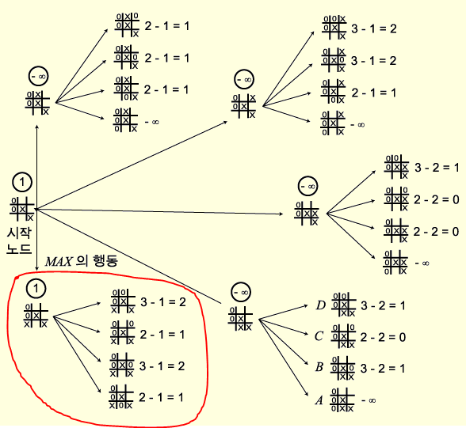
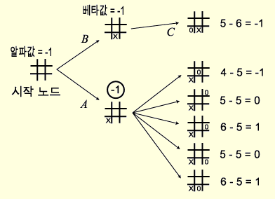

AI(인공지능) - artificial intelligence

##### [3. Adversarial Search(적대적 탐색) - 20.02.20 LHJ](#adversarial-search)

---

## Adversarial Search

### Adversarial Search(적대 탐색) 란?

- AI 프로그램(게임 프로그램)들은 탐색 알고리즘으로 **[Minimax algorithm](Minimax-algorithm),** **[alpha-beta pruning](Alpha-Beta-Pruning)** 등을 사용하는데, 이러한 알고리즘을 사용한 탐색을 적대 탐색이라고 한다.

- 적대 탐색에서는 두 명의 게임플레이어 중 한 명이 이기거나, 지거나 ,비길 때까지 번갈아 행동하는 것을 가정한다. 또, 사용가치가 서로 상반되기 때문에 한쪽이 점수를 얻으면, 한쪽은 잃게 된다. 이러한 특성이 적대적인 상황을 만든다.

- 게임이론 용어 :

  - Deterministic : 어떤 행동의 결과도 예측 가능하다. 즉, operation이 정확히 수행된다.
  
  - turn-taking : 두 플레이어의 행동이 번갈아서 일어난다. 즉, 동시에 작동하는 경우가 없다.
  
  - zero-sum game : 모든 이득의 총합이 항상 제로인 게임
  
  - perfect information : 현재 모든 게임 상태는 완전히 관찰 가능하다. 즉, optimal하게 선택 가능하다.

<br>

**적대 탐색 알고리즘 소개 전 해당 장에서 필요한 정보**

- 해당 장에서는 두 명의 플레이어를 MAX와 MIN으로 표현한다.

- [Tic-Tac-Toe(삼목게임)에 대한 게임 트리](Game-Tree-for-Tic-Tac-Toe)를 예시로 사용한다.

- 게임트리의 대략적인 사이즈

  - b = branching factor(각 노드의 자식 노드 수)
  
  - d = search depth 라고 할 때, **O(b^d)**
  
  - 체스의 경우, b ~ 35 / d ~ 100 으로 엄청 큰 사이즈이기 때문에 이것을 다 탐색하기는 어렵다. 그래서 Game-playing은 **한정된 시간에 최적의 결정**을 내리는 것을 강조한다.
  
  -  주요 쟁점은 " 커다란 게임트리에서 어떻게 optimal move를 탐색할 것인가? " 이다. 이를 위해 적대 탐색 알고리즘이 사용된다.
  
<br>  

**Game Tree for Tic Tac Toe**

<br>



### 적대 탐색 알고리즘 종류

#### 1. Minimax algorithm(최대최소 방법)

- 본인 차례에는 본인에게 제일 유리한 수, 상대방 차례에는 본인에게 제일 불리한 수가 선택하며, 다음 턴만이 아니라 그 이후까지 바라보며 탐색하는 과정이다.

- **MAX** 가 X 를 표시하고, **MIN** 은 0 를 표시하며, **MAX** 가 먼저 시작한다고 가정하자. 깊이 제한이 2 인 경우, 레벨 2 의 모든 노드가 생성될 때까지 너비우선 탐색을 수행한 다음, 이들 노드에 대하여 평가 함수를 적용한다. 상태 p에 대한 평가 함수 e(p) 가 다음과 같이 주어진다고 하자.

  ```
  if MAX가 이기는 상태 : e(p) = ∞
  
  if MIN이 이기는 상태 : e(p) = -∞
  
  if 결정이 나지 않은 상태 : e(p) = (MAX에게 가능한 수) - (MIN에게 가능한 수)
  ```

만약 상태가 다음과 같다면, 



e(p) = 6 - 4 = 2 가 될 것이다.


**START**

탐색의 첫번째 단계




위부터 e(p)의 값이 각 1, -2, -1이기 때문에 MAX는 e(p) = 1 을 선택하여 행동할 것이다.



MIN은 여기에 대해 위 그림과 같이 X의 왼편에 O를 표시했다고 하자.(MIN은 좋은 탐색 전략을 갖고 있지 않다고 볼 수 있다.)

그리고 다시 MAX가 탐색을 수행하고 아래와 같은 탐색트리가 만들어진다.



여기서 두 가지 최상의 선택이 가능하지만, 빨간표시의 행동을 선택했다고 하자. 그렇다면 MIN은 패배를 피하기 위해 아래와 같은 행동을 취할 것이다.



MAX는 탐색을 다시 수행하여 아래와 같은 트리를 생성한다. MAX는 이번에도 최상의 선택을 할 것이고, 이 선택이 MAX의 패배를 피할 수 있는 행동이라는 것을 알 수있다. 그리고 다음 차례에서 MIN은 패배했다는 것을 알 수있고 게임은 종료된다.




#### 2. Alpha-Beta Pruning(알파 베타 방법)

- 위에 설명한 Minimax algorithm의 경우 탐색트리 생성 과정과 상태 평가 과정이 완전히 분리되어 있다. 즉, 트리 생성이 완전히 끝난 후에야 상태 평가가 시작된다. 그래서 비효율적인 전략이라고 볼 수 있다.

- 이를 보완하기 위해 나온 방법이 Alpha-Beta Pruning으로 최종 결정에 영향이 없는 노드들은 가지치기를 해 시간을 줄이는 것이다.


**Example**




위 그림을 예로 들어 설명해보자.

해당 그림은 노드 A와 A의 자식이 생성되고, B의 자식 노드 C까지 생성된 직후이다.

여기서 A의 평가값이 -1인데, 이 시점에서 시작 노드의 평가값은 -1 이상으로 제한된다.

왜냐하면 시작 노드는 MAX 차례이므로 최댓값을 탐색할 것이다. 근데 이미 A에서 평가값 -1을 받았으므로 그보다 작은 값을 선택할 수는 없다. 이 하한을 시작 노드의 **Alpha Value(알파값)** 라고 한다.

반대로 노드 B를 보면 노드 C의 평가값이 -1이기 때문에 노드 B의 평가값은 -1이하로 제한된다는 것을 확인할 수 있다. 왜냐하면 노드 B는 MIN 차례이므로 최솟값을 탐색할 것이다. 근데 노드 C에서 평가값 -1을 받았으므로 그보다 큰 값을 선택할 수 없다. 노드 B에 대한 이러한 상한을 **Beta Value(베타값)** 라고 한다.

즉,  

**MAX 노드의 알파값은 자식 노드의 평가값 중 현재까지 가장 큰 값이 된다.**

**MIN 노드의 베타값은 자식 노드의 평가값 중 현재까지 가장 작은 값이 된다.**


알파값보다 작거나 같은 베타값을 갖는 노드의 탐색을 중단하는 것을 **알파 절단(Alpha cut-off)** 라고 하고,

그 반대를 **베타 절단(Beta cut-off)** 라고 한다. 

그리고 이러한 과정을 수행해 가는 모든 과정을 일반적으로 **Alpha-Beta Pruning(알파 베타 방법)** 이라고 한다.


