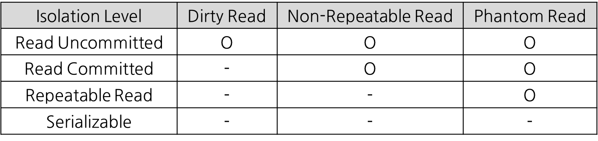
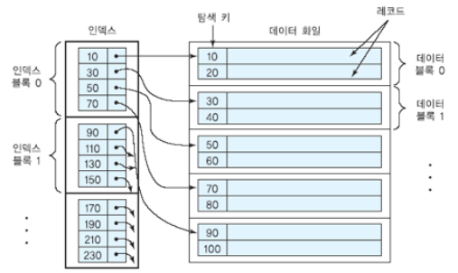
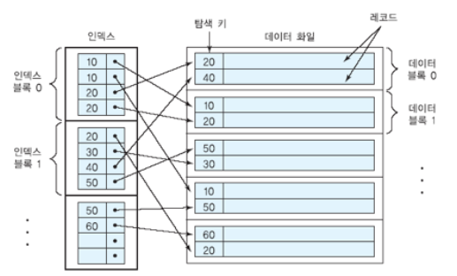
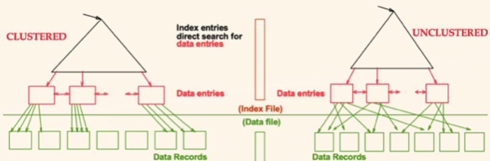
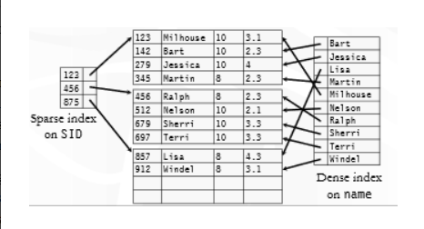
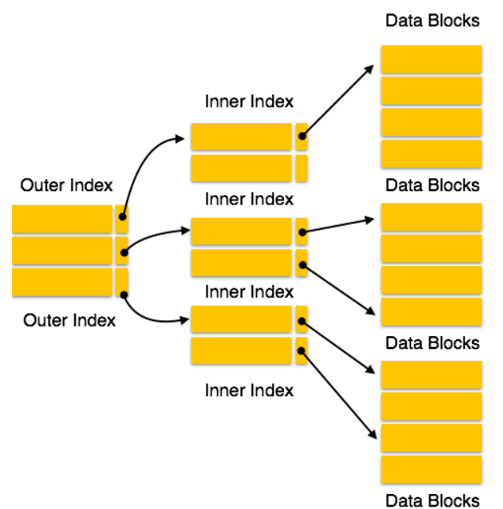
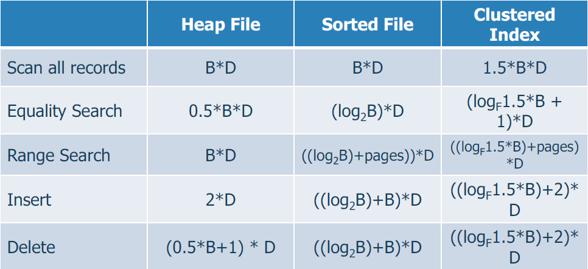
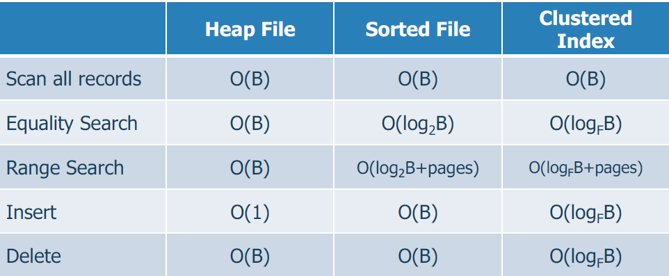

DB(데이터베이스) -data base

##### [1.DBMS(DataBase Management System) - 20.01.31 KDH](#DBMS)

##### [2. 데이터베이스 풀 - 20.01.31 KSW](#DatabasePool)

##### [3. 정규화(1NF, 2NF, 3NF, BCNF) - 20.01.31 KSW](#NormalForm)

##### [4. 트랜잭션(Transaction) - 20.01.31 UKK](#Transaction)

##### [7. INDEX 란? - 20.02.06 LHJ](#INDEX)

##### [8. Statement와PrepareStatement - 20.02.06 LHJ](#Statement/PrepareStatement)

---

## DBMS

#### 용어정리

* **데이터 (data)** : 의미를 가지며 기록될 수 있는 사실
* **데이터베이스 (database)** : 서로 연관이 있는 데이터의 모임
* **작은 세계(mini-world)** : 전체 세계의 일부분으로 데이터베이스 구축의 대상
* **데이터베이스 관리 시스템(DBMS)** : 데이터베이스를 생성하고, 데이터를 저장 및 관리할 수 있도록 하는 기능을 제공하는 전문 프로그램
* **데이터베이스 시스템 (database system)** : DBMS + DB
* **개체(object)** : 어떠한 사물들을 대표하는 것 (**학생** - 짱구, 철수 등등 /**수업** - DB, OS 등등 )
* **메타데이터(meta - data)** : 기본 데이터베이스의 구성, 데이터 항목 타입, 저장 구조, 제약조건을 명시하는 데이터
* **시스템 카탈로그 (system catalog)** : 메타 데이터를 저장 및 관리하는 장소
* **뷰(view)** : 전체 DB로부터 추출된 가상의 데이터 베이스

#### DB의 특징

* **데이터베이스 시스템의 자기 기술성** : DB내에서 데이터 자체 뿐만 아니라 DB 특성에 관한 데이터를 시스템에서 관리
* **프로그램과 데이터의 격리** : 데이터와 프로그램이 각각 따로 존재하여 데이터가 변경되어도 프로그램에 영향을 주지 않음
* **데이터 추상화** : 구조에 관한 상세 정보를 감춤(사용자에게 view만 제공함)
* **데이터에 대한 다중 뷰 제공** : 사용자의 관점에 따라서 다른 형태의 뷰를 제공
* **데이터 공유** : 다수의 사용자가 동시 접근 가능, 동시성 제어(concurrency control) 기능

#### DB사용자 분류

* **시스템 분석가** : 사용자의 요구사항 분석, 이에 만족하는 트랜잭션 명세 설계
* **DB 설계자** : DB에 저장된 데이터를 선정, DB의 구조 및 특성을 정의
* **응용 프로그래머** : 트랜잭션 명세를 참고하여 응용 프로그램 작성
* **DB관리자 (DBA)** : DB 시스템과 관련된 자원 관리
* **최종 사용자** : DB에 대하여 질의, 변경, 보고서 등을 작성하는 사람
* **DBMS 설계 및 구현자** : DBMS 모듈들과 인터 페이스들을 소프트웨어 패키지로 설계하고 구현
* **도구 개발자** : 데이터베이스 설꼐, 사용, 성능 개선등에 필요한 소프트웨어 설계 및 구현
* **운영 및 유지 보수자** : DB시스템을 위한 하드웨어 및 소프트웨어 환경의 운영 및 유지 보수

#### DBMS의 기능

* 데이터 중복의 제어
  * 데이터 중복 : 동일한 데이터가 여러 곳에서 저장 및 관리
    * 문제점 : 디스크의 낭비, 데이터 일관성(consistency)의 결여 유발
  * 여러 사용자가 하나의 DB를 공유하도록 하여 이러한 중복의 문제 해결
* 권한없는 접근의 통제
  * 접근이 허용된 사용자만 데이터에 접근 가능, 권한 관리 가능
* 프로그램 데이터의 지속성 제공
  * 프로그램과 데이터는 독립적이므로 프로그램에 상관없이 데이터 보존
* 다양한 사용자 인터페이스 제공
  * 사용자에 따라 적합한 형테의 DB접근 방법 제공 (질의어, 프로그래밍 인터페이스 등)
* 관계 표현 기능
  * 서로 다른 데이터간에 다양한 형태의 연관성을 표현할 수 있는 기능 제공
* **무결성 제약 조건의 시행**
  * 무결성 : 응용 데이터가 지정된 제약 조건을 만족해야 하는 성질
  * 무결성에 관한 제약 조건을 정의, 정의된 무결성 제약 조건을 검사
* 백업 및 회복
  * 하드웨어 및 소프트웨어이 고장으로부터 복구 가능
  * 백업 : DB내의 데이터를 중복 저장하는 기능
  * 회복 : 고장시 백업된 데이터로부터 최신 데이터 복구하는 기능

#### DB사용 효과

* **표준화에 공헌** : 조직 내 모든 부서가 표준화 하여 데이터 관리
* **응용 프로그램 개발 시간 단축** : DBMS를 이용해서 처리가 가능하므로 개발 부담 줄음.
* **데이터베이스 구조 수정에 융통성제공** : DB내 자료 구조가 변경되어도 사용자에 영향 X
* **항상 최신의 정보 제공** : 다른 사람의 변경사항을 즉시 참조
* **규모의 경제성** : 조직내 데이터 통합관리로 업무의 중복성이 줄음.

##### DBMS를 사용시 단점

1. 초기 투자비용이 높음.
2. 보안, 동시성 제어, 회복, 무결성 조건 등의 오버헤드가 큼.
3. 단순 작업 시에는 굳이 필요 X.
4. 실시간 데이터 처리 요구 사항이 엄격한 경우 적절하지 않음.
5. 단일 사용자 사용 시 적절하지 않음.

#### 데이터 모델의 개념

* 데이터 추상화를 제공하기 위한 도구
* DB의 구조를 명시하는데 사용되는 개념들의 집합
* 제공하는 개념들의 유형에 따라 모델 분류 가능

#### 데이터 모델의 분류

* 물리적 데이터 모델
  * 데이터가 컴퓨터 내에서 물리적으로 어떻게 저장되는가에 관한 세부 사항을 명시
  * 실질적 데이터 저장 방식과 low-level의 데이터 모델
  * 레코드 형식, 순서, 접근 경로 등의 정보 제공
* 개념적 데이터 모델
  * 데이터를 개념적으로 표현하는 방식
  * 일반 사용자들이 인식하는 방식과 밀접한 상위 수준의 데이터 모델
  * 대표적인 예시 ER모델
* 표현 데이터 모델
  * 물리적 데이터 모델과 개념적 데이터 모델의 중간 수준
  * 일반 사용자들이 이해할 수 있는 방식으로 데이터를 표현하면서도 실질적 데이터 저장방식과도 잘 대응되는 방식 제공
  * 대부분의 DBMS에서 채택
  * 예시 : 관계 모델, 네트워크 모델, 계층 모델

#### 스키마와 인스턴스

* 스키마

  * 데이터 베이스 구조에 대한 명세
  * 설계과정에서 정의
  * 자주 변경 X
  * 구성
    * 내부단계 : 물리적 저장 구조를 기술하는 내부 스키마
    * 개념단계 : 전체 DB의 논리적 구조를 기술하는 개념 스키마
    * 외부단계 (view단계) : 사용자에 따라서 특정 부분만 기술하는 외부 스키마(뷰)

   

* 인스턴스

  * 특정 시점의 DB 내용. 데이터 그 자체로 이해하면 편함.
  * 새로운 데이터의 삽입, 갱신, 삭제에 따라 지속적 변경.

#### 데이터 독립성

* 하위 단계의 스키마를 변경하여도 상위 단계의 스키마에 영향 X
* 논리적 데이터 독립성 : 개념 스키마가 변경되어도 외부 스키마가 영향 X
* 물리적 데이터 독립성 : 내부 스키마가 변경되어도 개념 스키마가 영향 X

#### DBMS 분류

* 데이터 모델에 의한 분류
  * 관계모델 : 레코드들의 집합을 포함하는 다수의 테이블로 표현
  * 네트워크 모델 : 레코드 타입과 1:N 관계의 집합 타입
  * 계층 모델 : 계층적 트리 구조를 이용하여 표현
  * 객체지향 모델 : 객체들의 집합을 포함하는 다수의 클래스로 표현
* 사용자 수에 의한 분류
  * 단일 사용자용
  * 다수 사용자용
* 분산 사이트 수에 의한 분류
  * 중앙 집중형 DBMS
  * 분산 DBMS
* 용도에 의한 분류
  * 범용 DBMS
  * 특수 목적용 DBMS

---

## DatabasePool

#### Connection Pool

DB와 미리 connection( 연결 )을 해놓은 객체들을 pool( 웅덩이 )에 저장해두었다가,

클라이언트 요청이 오면 커넥션을 빌려주고, 볼일이 끝나면 다시 커넥션을 반납받아 pool에 저장하는 방식

클라이언트가 DB와 연결이 필요할 때, connection pool에서 connection을 빌려와 DB에 접근해서 쿼리를 막 날린 후, 볼 일이 끝나면 사용했던 connection을 다시 pool에 반납을 하는 과정

 

#### Connction이 부족하면?

- 모든 요청이 DB에 접근하고 있고 남은 Conncetion이 없다면, 해당 클라이언트는 대기 상태로 전환시키고 Pool에 Connection이 반환되면 대기 상태에 있는 클라이언트에게 순차적으로 제공된다.

#### 왜 사용할까?

- 매 연결마다 Connection 객체를 생성하고 소멸시키는 비용을 줄일 수 있다.
- 미리 생성된 Connection 객체를 사용하기 때문에, DB 접근 시간이 단축된다.

 

​	=> 미리 연결을 맺고 있는 커넥션들이 있기 때문에 커넥션을 맺고 끊는 과정이 불필요.

​		 즉, DB 접근 시 **불필요한 작업( 커넥션 생성, 끊기 )이 사라지므로 성능향상을 기대**

 

- DB에 접근하는 Connection의 수를 제한하여, 메모리와 DB에 걸리는 부하를 조정할 수 있다.

  => 커넥션 또한 객체이므로 **메모리를 차지**

  ​	 따라서 무작정 많이 늘리는 것은 메모리를 많이 차지하게 되므로 오히려 성능이 떨어지는 결과 초래

 

#### Thread Pool

- 비슷한 맥락으로 Thread pool이라는 개념도 있다.
- 이 역시 매 요청마다 요청을 처리할 Thread를 만드는것이 아닌, 미리 생성한 pool 내의 Thread를 소멸시키지 않고 재사용하여 효율적으로 자원을 활용하는 기법.

#### Thread Pool과 Connection pool

- WAS(Web Application Server)에서 Thread pool과 Connection pool내의 Thread와 Connection의 수는 직접적으로 메모리와 관련이 있기 때문에, 많이 사용하면 할 수록 메모리를 많이 점유하게 된다. 그렇다고 반대로 메모리를 위해 적게 지정한다면, 서버에서는 많은 요청을 처리하지 못하고 대기 할 수 밖에 없다.
- 보통 WAS의 Thread의 수가 Conncetion의 수보다 많은 것이 좋은데, 그 이유는 모든 요청이 DB에 접근하는 작업이 아니기 때문이다.

 

## NormalForm

#### 정규화

*관계형 데이터베이스의 설계에서 중복을 최소화하게 데이터를 구조화하는 프로세스를* *정규화라고 한다.*

함수적 종속성을 이용해서 연관성 있는 속성들을 분류하고, 각 릴레이션들에서 이상현상이 생기지 않도록 하는 과정을 말한다.

**데이터베이스 정규화의 목적은 주로 두 가지이다.**

> 1. 불필요한 데이터(data redundancy)를 제거한다.
>
> 2. 데이터 저장을 "논리적으로" 한다.(테이블의 구성이 논리적이고 직관적)

우선 정규화를 안 했을 때의 문제점에 대해서 알아보면

| **STUDENT_ID** | **STUDENT_NM** | S_Address | Subject_opted |
| -------------- | -------------- | --------- | ------------- |
| 401            | Adam           | Nodia     | Bio           |
| 402            | Alex           | Panipat   | Maths         |
| 403            | Stuart         | Jammu     | Maths         |
| 404            | Adam           | Noida     | Physics       |

  위와 같이 정규화가 되지 않은 구조의 테이블의 경우, 데이터 핸들링시 다양한 이상현상이 발생하게 된다.

1. **Update** : Adam의 Address가 변경되었을 때, 여러줄의 데이터를 갱신해야한다. 이로인해 데이터의 불일치(inconsistency)가 발생할 수 있다.

2. **Insert** : 만약 학생이 아무 과목도 수강하지 않는다고 하면, Subject_opted 컬럼에는 NULL이 들어갈 것이다.

3. **Deletion** : 만약 Alex 학생이 과목 수강을 취소한다면 Alex의 레코드가 아예 테이블에서 지워져버린다.

 

위와 같이 정규화가 제대로 되지 않은 테이블의 경우 갱신/삽입/삭제 시 다양한 문제점이 발생할 수 있다. 이를 테이블의 구성을 논리적으로 변경하여 해결하고자 하는 것이 바로 정규화이다.

 

#### 제 1 정규형 (1NF; First Normal Form)

*릴레이션에 속한 모든 속성의 도메인이 원자 값으로만 구성되어 있으면 **제1정규형**에 속한다.*

 

| **STUDENT_ID** |          **COURSE_ID**          |   GRADE   | STUDENT_NM |
| :------------: | :-----------------------------: | :-------: | :--------: |
|    20800399    | CSE011101, CSE022202, CSE033303 | A+, A, B+ |    야붕    |

위와같은 형태의 릴레이션은 제1정규형을 만족하지 않는다. 최소한 아래와 같은 형태가 되어야 제1정규형을 만족한다고 할 수 있다.

 

관계형 데이터베이스의 릴레이션은 모든 속성이 원자 값을 가지는 특성이 있기 때문에, 최소한 제1정규형을 만족해야 릴레이션이 될 자격이 있다.

| **STUDENT_ID** | **COURSE_ID** | GRADE | STUDENT_NM |
| :------------: | :-----------: | :---: | :--------: |
|    20800399    |   CSE011101   |  A+   |    야붕    |
|    20800399    |   CSE022202   |   A   |    야붕    |
|    20800399    |   CSE033303   |  B+   |    야붕    |

 

#### 제 2 정규형 (2NF; Second Normal Form)

제1정규형만 만족시키는 릴레이션에서 부분 함수 종속성을 가지게 되는 경우 삽입이상, 갱신이상, 삭제이상 세가지 이상현상이 모두 나타나게 된다.

*제1정규형에 속하면서, 기본키가 아닌 모든 속성이 기본키에 완전 함수 종속(기본키 중에 특정 컬럼에만 종속된 컬럼이 없어야 함)되면 **제2정규형**이다.*

 

| **학번**(P) | **과목코드**(P) | 성적 | 학부         | 등록금 |
| ----------- | --------------- | ---- | ------------ | ------ |
| 20800399    | CSE011101       | A+   | 컴퓨터공학부 | 350    |
| 20800399    | CSE022202       | A    | 컴퓨터공학부 | 350    |
| 20800399    | CSE033303       | B+   | 컴퓨터공학부 | 350    |
| 21300758    | MEC011101       | F    | 경영학부     | 300    |
| 21400001    | POD032939       | C+   | 기계공학부   | 400    |
| 21500399    | CSE011101       | D    | 컴퓨터공학부 | 350    |

위 릴레이션의 함수적 종속성을 살펴보면 아래와 같다.

> {학번, 과목코드} => 성적
> {학번, 과목코드} => 학부
> {학번, 과목코드} => 등록금
> 학번 => 학부
> 학번 => 등록금
> 학부 => 등록금

현재 학번 => 학부, 학번 => 등록금 두개의 부분 함수 종속성을 가지고 있다. 이를 제거해 주는 것을 제2정규화라고 한다.

 

학번->학부, 학번->등록금 두개의 부분 함수 종속성을 제거하여 분리한 두개의 릴레이션은 아래와 같다.

**학생 릴레이션**

| **학번**(P) | 학부         | 등록금 |
| ----------- | ------------ | ------ |
| 20800399    | 컴퓨터공학부 | 350    |
| 21300758    | 경영학부     | 300    |
| 21400001    | 기계공학부   | 400    |
| 21500399    | 컴퓨터공학부 | 350    |

**성적 릴레이션**

| **학번**(P) | **과목코드**(P) | 성적 |
| ----------- | --------------- | ---- |
| 20800399    | CSE011101       | A+   |
| 20800399    | CSE022202       | A    |
| 20800399    | CSE033303       | B+   |
| 21300758    | MEC011101       | F    |
| 21400001    | POD032939       | C+   |
| 21500399    | CSE011101       | D    |

릴레이션이 둘로 분해되면서 학부와 등록금에 대한 중복항목이 제거되었다. 정규화 과정에서 주의할 점은 정규화를 통해 분해된 릴레이션들이 조인을 통해 원래의 구조로 복원될 수 있어야 한다는 것이다.

두 릴레이션 모두 제1정규형에 속하고, 기본키가 아닌 모든 속성이 기본키에 완전 함수 종속되므로 제2정규형을 만족한다.

 

> 제 2 정규형을 만족하면 이상현상이 없어질까?  **그렇지 않다.**

**삽입이상**
새로운 학부가 생기는 경우 등록된 학생(학번)이 없다면 학번속성이 NULL이 되므로 삽입할 수 없다.

**갱신이상**
컴퓨터공학부 등록금이 400으로 오르는 경우 20800399, 21500399 둘 모두 바꾸어 주지 않으면 데이터 불일치 문제가 발생한다.

**삭제이상**
21400001 학번을 가진 학생이 자퇴하는 경우, 기계공학부에 대한 정보가 함께 사라진다.

제2정규형에서도 이상현상이 발생하는 이유는 **이행적 함수 종속**이 존재하기 때문이다. 이행적 함수 종속을 없애주는 과정이 **제 3 정규화**이다.

 

#### 제 3정규형(3NF; Third Normal Form)

*제 2 정규형에 속하면서, 기본키가 아닌 모든 속성이 기본키에 이행적 함수 종속이 되지 않으면 **제 3 정규형**이다.*

 
**이행(移行)적 함수 종속 (Transitive Functional Dependency)**

이행적 함수 종속이라는 게 뭐냐하면 삼단논법 같은 관계를 가진 함수종속이다. X, Y, Z 에 대해 X->Y 이고 Y->Z 이면 X->Z 가 성립한다. 이를 Z 가 X 에 이행적으로 함수 종속되었다고 한다.

학생 릴레이션에서 함수적 종속성은 아래와 같다.

> 학번(X) -> 학부(Y)
> 학부(Y) -> 등록금(Z)
> 학번(X) -> 등록금(Z)

학부에 따라 등록금이 결정되는 것이지 학번에 따라 결정되는 것은 아니므로 두 개의 릴레이션으로 분리

(X->Y, Y->Z 함수적 종속관계로 인해 X->Z 의 이행적 함수 종속 관계가 나타나면 [X, Y], [Y, Z] 두 릴레이션으로 분해)

**이행적 종속 관계를 제거 한 학생 릴레이션과 학부 릴레이션은 아래와 같다.**

| **학번** | 학부         |
| -------- | ------------ |
| 20800399 | 컴퓨터공학부 |
| 21300758 | 경영학부     |
| 21400001 | 기계공학부   |
| 21500399 | 컴퓨터공학부 |

| 학부         | 등록금 |
| ------------ | ------ |
| 컴퓨터공학부 | 350    |
| 경영학부     | 300    |
| 21500399     | 400    |

> 제 3 정규형을 만족하면 이상현상이 없어질까? **그렇지 않다.**

지금까지 살펴본 세가지 릴레이션에서는 기본키가 될 수 있는 후보키가 하나 밖에 없었다. 하지만 **후보키를 여러개 가지고 있는 릴레이션**에서는 제3정규형을 만족하더라도 이상현상이 생길 수 있다.

이를 해결하기 위한 정규형이 보이스-코드 정규형 (BCNF; Boyce-Codd Normal Form)이다. 제3정규형보다 조금 더 엄격한 제약조건을 가지기 때문에 Strong 3NF 라고도 한다.

 

#### BCNF (Boyce-Codd Normal Form)

모든 결정자가 Candidate KEY 인 경우 **BCNF** 이다

BCNF 를 위반하는 릴레이션은 이론적으로는 아래와 같은 구조를 가지게 된다.

위 릴레이션은 1NF 는 만족한다는 가정하에,

- 기본키가 아닌 모든 속성이 기본키에 완전 함수 종속이므로 2NF 를 만족한다.
- 기본키가 아닌 모든 속성이 기본키에 이행적 함수 종속이 되지 않으므로 3NF 를 만족한다.

하지만, 결정자인 C 가 슈퍼키가 아니다. 그러므로 BCNF 를 위반한다. A, B, C 속성만 사용해서 예제를 만들어보자.

##### BCNF를 위반 하는 예제

키로 사용될 수 있는 속성은 {Student, Course} 혹은 {Course, Instructor} 가 될 수 있다. 이 중에서 {Student, Course} 를 기본키로 선정했다.

3NF 까지 만족하지만 BCNF 를 만족하지 않는 경우에도 삽입이상, 갱신이상, 삭제이상이 생길 수 있다.

**삽입이상**
Algorithms 라는 수업이 Dijkstra 에 의해 열렸다고 하자. 하지만 수강생이 아무도 없는 경우 삽입할 수 없다.

**갱신이상**
James Gosling 이 담당하는 강의가 바뀌게 될 경우 수강생의 수만큼 갱신해줘야 하므로 하나라도 빠뜨리면 데이터 불일치 문제가 발생할 여지가 있다.

**삭제이상**
모찌가 자퇴해서 Computer Architecture 수업의 수강생이 없어지면 Alan Turing 이라는 강사도 사라진다.

 

분해한 두 개의 릴레이션에서 기존 릴레이션에서 결정자역할을 했던 속성을 키로 해준다. 그러면 BCNF 까지 만족시키는 릴레이션 두 개가 생기게 된다.

#### 제 4정규형(4NF)

다치 종속(MVD, 다중 값 종속)이 존재할 경우 이를 분해하는 과정

#### 제 5정규형(5NF)

조인 종속이 후보키를 통해서만 성립이 되도록 하는 과정

## Transaction
### 트랜잭션이란
* 트랜잭션(Transaction) 이란
    * 데이터베이스의 상태를 변환시키는 하나의 논리적인 작업 단위를 구성하는 연산들의 집합이다.
        * 예를들어, A계좌에서 B계좌로 일정 금액을 이체한다고 가정하자.
          1. A계좌의 잔액을 확인한다.
          2. A계좌의 금액에서 이체할 금액을 빼고 다시 저장한다.
          3. B계좌의 잔액을 확인한다.
          4. B계좌의 금액에서 이체할 금액을 더하고 다시 저장한다.
        * 이러한 과정들이 모두 합쳐져 계좌이체라는 하나의 작업단위를 구성한다.
    * 하나의 트랜잭션은 Commit 되거나 Rollback 된다.
        * Commit 연산
            * 한개의 논리적 단위(트랜잭션)에 대한 작업이 성공적으로 끝나 데이터베이스가 다시 일관된 상태에 있을 때, 이 트랜잭션이 행한 갱신 연산이 완료된 것을 트랜잭션 관리자에게 알려주는 연산이다.
        * Rollback 연산
            * 하나의 트랜잭션 처리가 비정상적으로 종료되어 데이터베이스의 일관성을 깨뜨렸을 때, 이 트랜잭션의 일부가 정상적으로 처리되었더라도 트랜잭션의 원자성을 구현하기 위해 이 트랜잭션이 행한 모든 연산을 취소(Undo)하는 연산이다.
            * Rollback 시에는 해당 트랜잭션을 폐기하고, 선택적으로 재시작한다.
    * 데이터베이스 응용 프로그램은 트랜잭션들의 집합으로 정의 할 수 있다.
* 트랜잭션의 성질(ACID)
    * 원자성(Atomicity), All or nothing
        * 트랜잭션의 모든 연산들은 정상적으로 수행 완료되거나 아니면 전혀 어떠한 연산도 수행되지 않은 상태를 보장해야 한다.
    * 일관성(Consistency)
        * 트랜잭션 완료 후에도 데이터베이스가 일관된 상태로 유지되어야 한다. 모순성이 없어야한다.
    * 격리성(Isolation)
        * 하나의 트랜잭션이 실행하는 도중에 변경한 데이터는 이 트랜잭션이 완료될 때까지 다른 트랜잭션이 참조하지 못한다.
        * 어느 강도로 참조하지 못하게 막을 것인지는 트랜잭션 격리 수준 설정 레벨에 달라짐
    * 영속성(Durability)
        * 성공적으로 수행된 트랜잭션은 영원히 반영되어야 한다.
* 트랜잭션의 필요성
    * 현금 인출기를 작동하는 도중에 기계오류나 정전 등과 같은 예기치 않은 상황이 발생하여 카드가 나오지 않거나 기계가 멈추는 경우
    * 각각 다른 지점의 은행에서 동시에 인출할 때, 하나의 지점이 다른 지점에서 저장한 잔액을 덮어 쓰는 경우
    * 위와 같은 상황이 발생되지 않도록 방지하기 위해, 즉, 트랜잭션의 성질인 ACID를 제공받기위해 트랜잭션을 사용한다.
* 트랜잭션의 상태  
    
    * 활동(Active)
        * 트랜잭션이 실행 중에 있는 상태, 연산들이 정상적으로 실행 중인 상태
    * 장애(Failed)
        * 트랜잭션이 실행에 오류가 발생하여 중단된 상태
    * 철회(Aborted)
        * 트랜잭션이 비정상적으로 종료되어 Rollback 연산을 수행한 상태
    * 부분 완료(Partially Committed)
        * 트랜잭션이 마지막 연산까지 실행했지만, Commit 연산이 실행되기 직전의 상태
    * 완료(Committed)
        * 트랜잭션이 성공적으로 종료되어 Commit 연산을 실행한 후의 상태

### 트랜잭션 격리 수준
* Isolation Level 이란?
    * 트랜잭션에서 일관성이 없는 데이터를 허용하도록 하는 수준
* Isolation Level 의 필요성
    * 데이터베이스는 ACID 같이 트랜잭션이 원자적이면서도 독립적인 수행을 하도록 한다.
    * 그래서 Locking 이라는 개념이 등장한다.
        * 트랜잭션이 DB를 다루는 동안 다른 트랜잭션이 관여하지 못하게 막는 것
    * 하지만 무조건적인 Locking으로 동시에 수행되는 많은 트랜잭션들을 순서대로 처리하는 방식으로 구현되면 DB의 성능은 떨어지게 된다.
    * 반대로 응답성을 높이기 위해 Locking 범위를 줄인다면 잘못된 값이 처리 될 여지가 있다.
    * 그래서 최대한 효율적인 Locking 방법이 필요하다.
* Isolation Level 의 종류
    1. Read Uncommitted (레벨 0)
        * SELECT 문장이 수행되는 동안 해당 데이터에 Shared Lock이 걸리지 않는 Level
        * 트랜잭션에 처리중인 혹은 아직 커밋되지 않은 데이터를 다른 트랜잭션이 읽는 것을 허용한다.
        * 따라서, 어떤 사용자가 A라는 데이터를 B라는 데이터로 변경하는 동안 다른 사용자는 아직 완료되지 않은(Uncommitted 혹은 Dirty) 트랜잭션이지만 변경된 데이터인 B를 읽을 수 있다.
        * 데이터베이스의 일관성을 유지할 수 없다.
    2. Read Committed (레벨 1)
        * SELECT 문장이 수행되는 동안 해당 데이터에 Shared Lock이 걸리는 Level
        * 트랜잭션이 수행되는 동안 다른 트랜잭션이 접근할 수 없어 대기하게 된다.
        * Commit이 이루어진 트랜잭션만 조회할 수 있다.
        * 따라서, 어떤 사용자가 A라는 데이터를 B라는 데이터로 변경하는 동안 다른 사용자는 해당 데이터에 접근할 수 없다.
        * SQL Server가 Default로 사용하는 Isolation Level
    3. Repeatable Read (레벨 2)
        * 트랜잭션이 완료될 때까지 SELECT 문장이 사용하는 모든 데이터에 Shared Lock이 걸리는 Level
        * 트랜잭션이 범위 내에서 조회한 데이터의 내용이 항상 동일함을 보장한다.
        * 따라서, 다른 사용자는 그 영역에 해당되는 데이터에 대한 수정이 불가능하다.
    4. Serializable (레벨 3)
        * 트랜잭션이 완료될 때까지 SELECT 문장이 사용하는 모든 데이터에 Shared Lock이 걸리는 Level
        * 완벽한 읽기 일관성 모드를 제공한다.
        * 따라서, 다른 사용자는 그 영역에 해당되는 데이터에 대한 수정 및 입력이 불가능하다.
    * Isolation level 조정은 동시성이 증가되는데 반해 데이터 무결성에 문제가 발생할 수 있고, 데이터의 무결성을 유지하는 데 반해 동시성이 떨어질 수 있다.
    * 레벨이 높아질수록 비용이 높아진다.
* 낮은 단계의 Isolation Level 이용시 발생하는 현상  
    
    * Dirty Read
        * 커밋되지 않은 수정 중인 데이터를 다른 트랜잭션에서 읽을 수 있도록 허용할 때 발생하는 현상
        * 어떤 트랜잭션에서 아직 실행이 끝난지 않은 다른 트랜잭션에 의한 변경 사항을 보게 되는 되는 경우
    * Non-Repeatable Read
        * 한 트랜잭션에서 같은 쿼리를 두 번 수행할 때 그 사이에 다른 트랜잭션이 값을 수정 또는 삭제함으로써 두 쿼리의 결과가 상이하게 나타나는 비 일관성 현상
    * Phantom Read
        * 한 트랜잭션 안에서 일정 범위의 레코드를 두 번 이상 읽을 때, 첫 번째 쿼리에서 없던 레코드가 두 번째 쿼리에서 나타나는 현상
        * 이는 트랜잭션 도중 새로운 레코드가 삽입되는 것을 허용하기 때문에 나타난다.
        
        
## INDEX
  

### INDEX 란?

- INDEX란 테이블에 저장된 데이터를 빠르게 조회할 수 있는, 즉 테이블에 대한 동작의 속도를 높여주는 자료구조를 일컫는다.  
  
- DBMS에서 INDEX는 데이터의 저장 성능을 희생하고, 데이터의 읽기 속도를 높이는 기능이다. 왜냐하면 인덱스는 항상 정렬된 상태를 유지하기 때문에 검색은 빠르지만, 추가/삭제/수정의 경우는 속도가 느려질 수 있다.

 
  
### INDEX를 사용해야 하는 경우

- 데이터의 양이 방대하고 검색이 변경보다 빈번한 경우  

- 인덱스를 걸고자 하는 필드의 값이 다양한 값을 가지는 경우

 

### INDEX를 위한 자료구조

1. B+-Tree Index

   - 데이터베이스의 인덱스 자료구조 중 가장 일반적이고, 범용적인 목적으로 사용되는 자료구조이다.
   
   - 칼럼의 원래 값을 변형시키지 않고, 인덱스 내에서는 항상 정렬된 상태로 유지  
     
2. Hash Index

   - 칼럼의 값으로 해시 값을 계산해서 인덱싱 하는 자료구조, 매우 빠른 검색을 지원하다.
   
   - 값을 변형해서 인덱싱하므로, 전방(Prefix) 일치와 같이 일부 값만 검색하고자 할 때는 사용할 수 없다.
   
   - 주로 메모리 기반 데이터베이스에서 사용

##### 일반적으로 B+-Tree를 사용하는 이유는?

Hash Index의 경우 데이터 접근 시간복잡도가 O(1)로 매우 빠르지만,  Select 조건에는 부등호 연산도 포함이 된다. 즉, Hash Index는 등호(=) 연산에 특화된 자료구조이기 때문에 데이터베이스의 자료구조로 적합하지 않다.

 

### 인덱스의 종류

#### 1. 키에 따른 인덱스 분류 (Primary Index VS Secondary Index)

- 기본 인덱스(Primary Index) 

  - 일반적으로 기본 키(primary key)를 포함하는 인덱스(키의 순서가 레코드의 순서를 결정지음)
  
  - 데이터 블록들 안의 행들의 정렬을 강요한다.
  
  - 키의 중복이 있으면 안된다.
  
  - 하나의 테이블에 오직 하나의 기본 인덱스만 가질 수 있다.
  
  

- 보조 인덱스(Secondary Index) 

  - 기본 인덱스 이외의 인덱스( 키의 순서가 레코드의 순서를 의미하지는 않음)
  
  

#### 2. 파일 조직에 따른 인덱스 (Clustered Index VS Unclustered Index)

- 집중 인덱스(Clustered Index) 

  - 레코드의 물리적 순서가 그 파일에 대한 인덱스 엔트리 순서와 동일하게(유사하게) 유지되도록 구성된 인덱스
  
  
- 비집중 인덱스(Unclustered Index) 

  - 집중 형태가 아닌 인덱스
   
  

#### 3. 데이터 범위에 따른 인덱스 분류 (Dense Index VS Sparse Index)

- 밀집 인덱스(Dense Index) 

  - 데이터 레코드 각각에 대해 하나의 인덱스 엔트리가 만들어진 인덱스

- 희소 인덱스(Sparse Index) 

  - 레코드 그룹 또는 데이터 블록에 대해 하나의 엔트리가 만들어지는 인덱스 
   
  

#### 4. 그 외

- 결합 인덱스(Composite Index)

  - 복수 개(2개 이상)의 칼럼으로 구성된 인덱스
  
  - 하나의 칼럼으로는 분포도가 넓어서 인덱스로 만들기에는 부적합하지만 결합을 할 경우 분포도가 양호해 지는경우 생성
  
- 다단계 인덱스(Multilevel Index)

  - 인덱스를 위한 인덱스, 인덱스를 좀 더 효율적으로 사용할 수 있다.
  
  - single-level을 사용 할 경우,  큰 사이즈의 인덱스를 메모리에 유지할 수 없기 때문에 사용한다.
      
    
     
  

#### 참고 - Cost of Operations

 

- Heap File : 가장 간단한 파일 구조인 순서가 없는 파일구조
- Sorted FIle : 페이지 내의 데이터가 정렬되어 있는 파일구조
- F : Fanout(한 노드의 자식 노드의 수)
- B : data block의 수
- D : Average time to read/write disk block

=======
