Data Structure(자료구조)

##### [2. List - 20.03.13 LHJ](#List)
##### [3. Stack & Queue - 20.03.13 LHJ](#Stack-and-Queue)
##### [4. Skip List - 20.03.13 LHJ](#Skip-List)

 

## List

순열(Sequence)이라고도 불리며, **순서**를 가지고 일렬로 나열한 원소들의 모임

순서가 있다는 점에서 **집합**과 구별 / 일렬로 나열되어 처음과 끝이 각 하나씩만 있다는 점에서 **그래프**와 구별 가능

 

#### 리스트 구분 

 

1)**구현 방식**에 따라

1-1) Array List (배열 리스트)

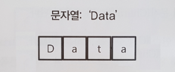

 

1-2) **Linked List (연결 리스트)**

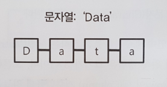

 

2)**사용 방식**에 따라

2-1) Simple List (단순 연결 리스트)

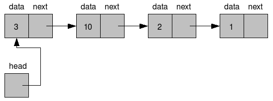

 

2-2) Doubly List (이중 연결 리스트)

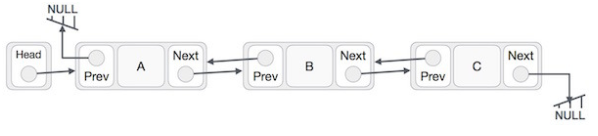

 

2-3) Circular List (환형 연결 리스트)

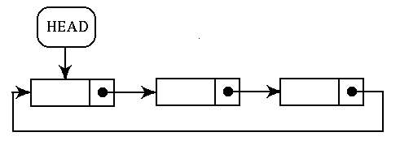

 

#### Linked List (연결 리스트)

: Node와 Node 간의 연결(link)을 이용해서 리스트를 구현한 것.

 

* ##### Linked List Header File

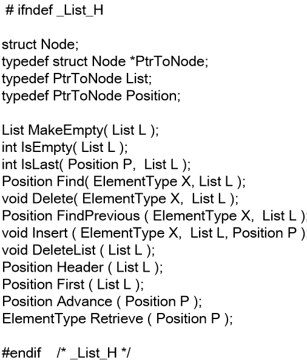

 

* **Node**

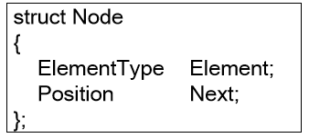

 

* **Insert**

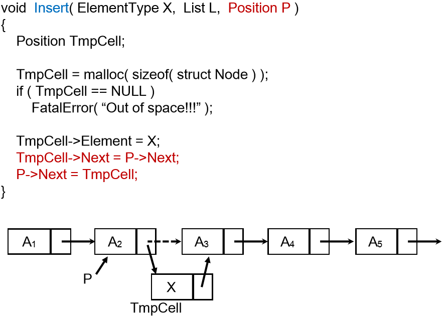

 

* **FindPrevious**

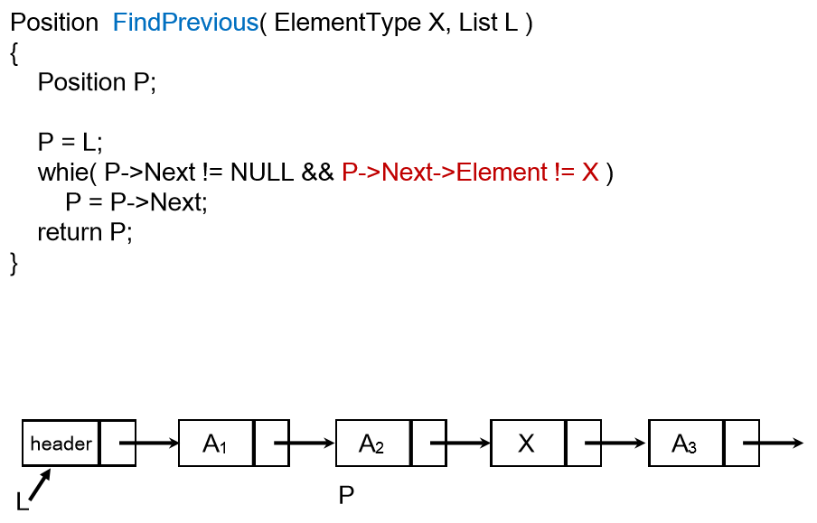

 

* **Delete**

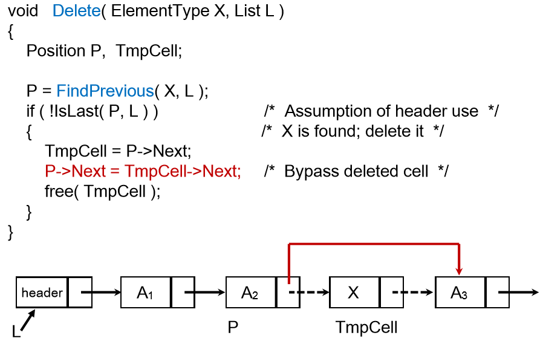

 

#### Doubly Linked List(이중 연결 리스트)

* **Insert**

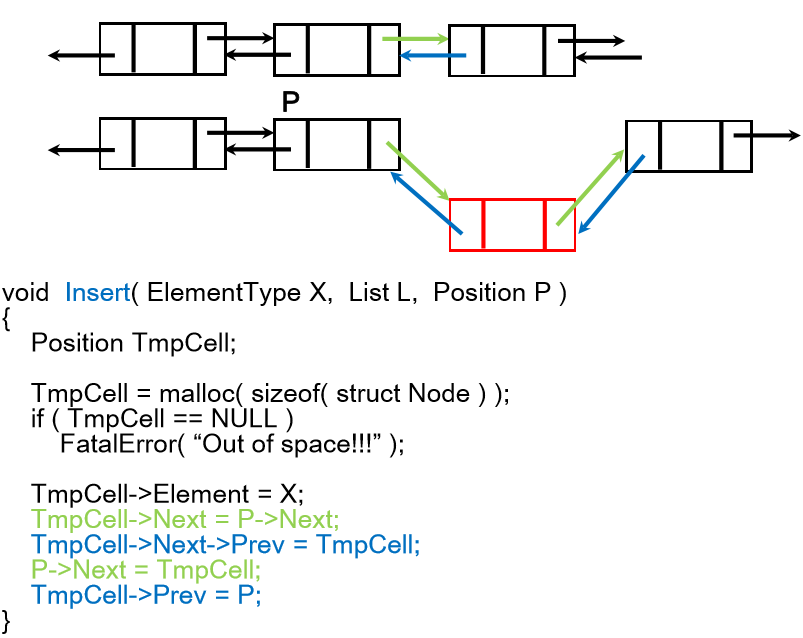

 

* **Delete**

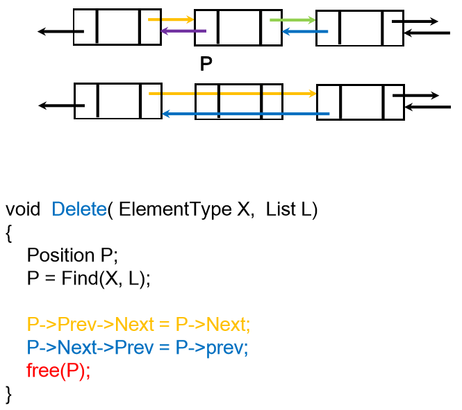

 

#### 배열 vs 연결리스트 장,단점

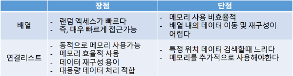

 

## Stack and Queue

## Stack

**스택(Stack)**은 한 쪽 끝에서만 자료를 넣거나 뺄 수 있는 **선형 구조(LIFO- Last In First Out)**으로 되어있습니다. **자료를 넣는 것을 PUSH**라고 하고 넣어둔 **자료를 꺼내는 것을 POP**이라고 합니다.

### Linked List로 구현한 Stack

* **Node**

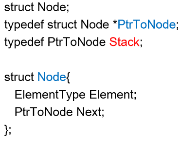

 

* **Create Stack  and MakeEmpty**

* **Push**

* **POP**

### Array List로 구현한 Stack

## Queue

: Queue는 가장 먼저 들어온 데이터가 가장 먼저 내보내지는 **(FIFO : First In First Out)** 구조를 가집니다.

### Linear Queue (선형 큐)

**선형 큐의 문제점**

일반적인 선형큐는 rear이 마지막 index를 가르키면서 데이터의 삽입이 이루어진다.

rear가 배열 마지막 index를 가르키게 되면 앞에 공간이 남아있어도 활용이 불가능하다.

### Circular Queue(원형 큐)

## Skip List
