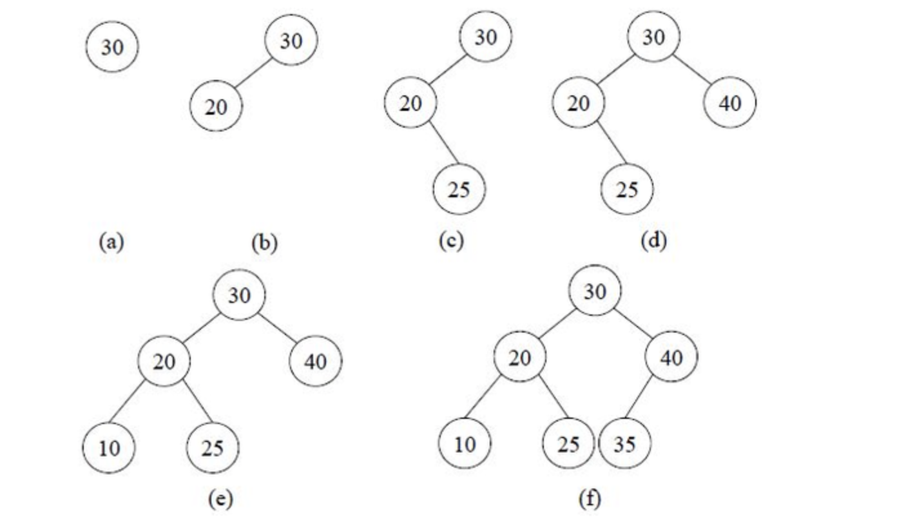
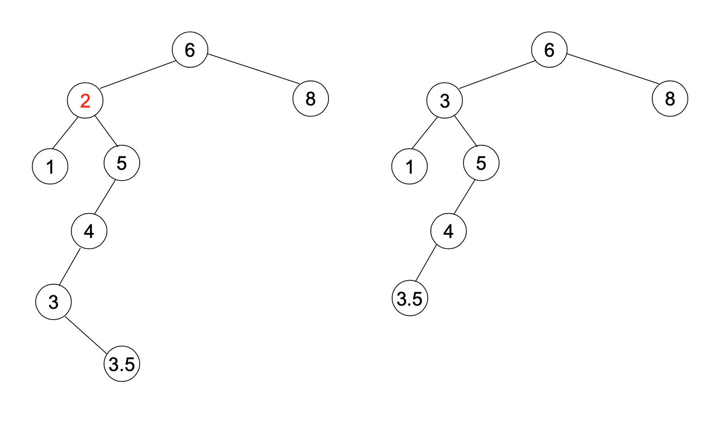
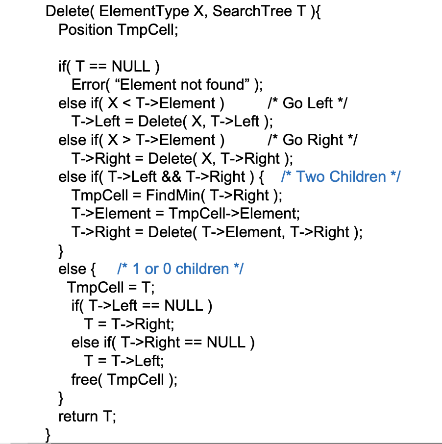
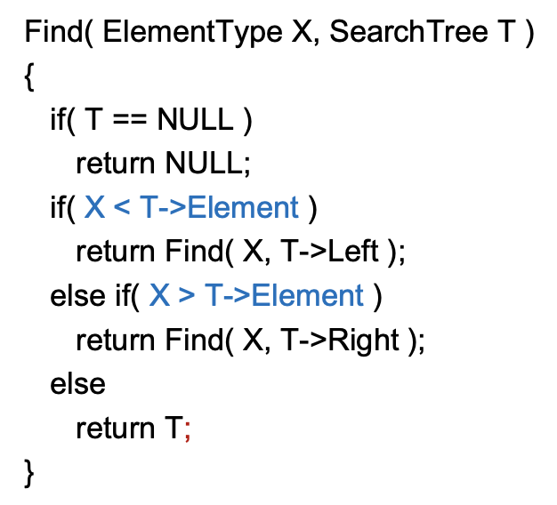
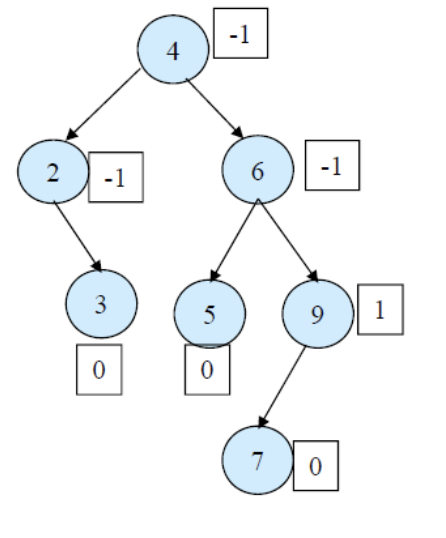
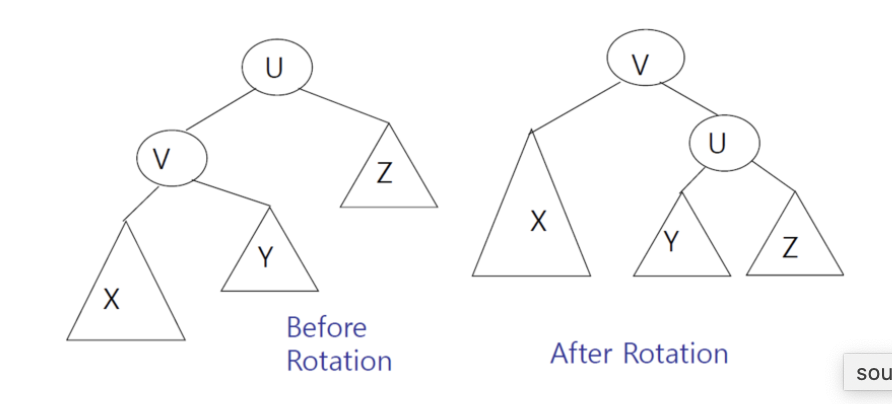
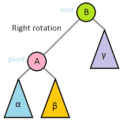
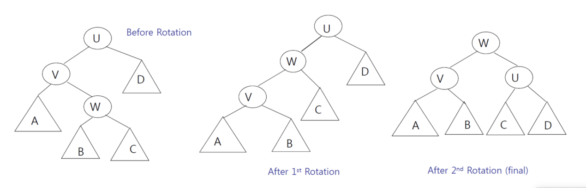
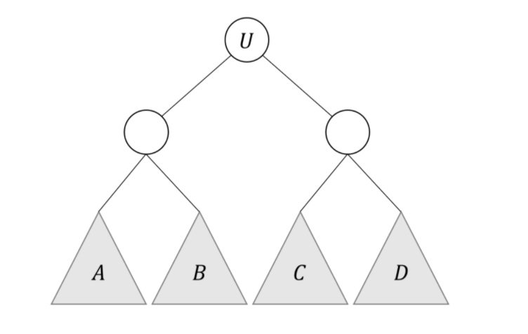

Data Structure(자료구조)
##### [1. Performance Analysis (intro) - 20.03.13 UKK](#Performance_Analysis)
##### [2. List - 20.03.13 LHJ](#List)
##### [3. Stack & Queue - 20.03.13 LHJ](#Stack-and-Queue)
##### [4. Skip List - 20.03.13 LHJ](#Skip-List)
##### [5. Tree - 20.03.13 UKK](#Tree)
##### [6. Heap - 20.03.13 UKK](#Heap)
 

### 자료구조 연산 Big-O

 

## Performance_Analysis
### 공간 복잡도
- 데이터 크기에 비례하여 얼마나 많은 메모리 공간을 사용해야 하는지 나타낸 것
### 시간 복잡도
- 데이터 크기에 비례하여 얼마나 많은 연산을 해야하는지 나타낸 것
##### 위의 복잡도는 O(g(n)) , Ω(g(n)), Θ(g(n))  로 나타냄.

- O(g(n)) : 충분히 큰 n에 대하여 f(n) <= C\*g(n)를 만족하는 상수 C가 존재할 경우 실제 계산량 f(n)을 O(g(n)) 로 나타낸다. 가령 선택정렬을 O(n^3)이라고 말하는데는 정의상 문제 없다. 하지만 가장 낮은 차수의 식으로 나타내야 의미가 있다.
- Ω(g(n)) :충분히 큰 n에 대하여 f(n) >= C\*g(n)를 만족하는 상수 C가 존재할 경우 실제 계산량 f(n)을 	Ω(g(n))로 나타낸다. 선택정렬을 Ω(n)이라고 하는데 문제가 없다.
- Θ(g(n)) : 충분히 큰 n에 대하여 c1·g(n) ≤ f(n) ≤ c2·g(n)를 만족하는 상수 c1, c2가 존재할 경우. 빅오와 빅오메가를 합쳐 좀 더 정밀한 복잡도를 표현할 때 사용한다 (하지만 빅오 표현을 더 많이 쓰긴 한다.)

*위의 복잡도는 데이터 크기를 기준으로 얘기를 하기 때문에, 가령 어떤 숫자 d가 소수인지 아닌지 판단하기 위해 2부터 d의 제곱근까지 약수를 구해 판단하는 알고리즘의 시간복잡도를 O(d^1/2)라고 얘기하기 쉽다. 하지만, 어떤 숫자 d의 크기는 log2(d)=n 이므로 시간복잡도는 O(2^n/2)라고 얘기해야 정확하다.

<image src="./assets/ukk/complexity.png">

 

## List

순열(Sequence)이라고도 불리며, **순서**를 가지고 일렬로 나열한 원소들의 모임

순서가 있다는 점에서 **집합**과 구별 / 일렬로 나열되어 처음과 끝이 각 하나씩만 있다는 점에서 **그래프**와 구별 가능

 

#### 리스트 구분 

 

1)**구현 방식**에 따라

1-1) Array List (배열 리스트)

 

1-2) **Linked List (연결 리스트)**

 

2)**사용 방식**에 따라

2-1) Simple List (단순 연결 리스트)

 

2-2) Doubly List (이중 연결 리스트)

 

2-3) Circular List (환형 연결 리스트)

 

#### Linked List (연결 리스트)

: Node와 Node 간의 연결(link)을 이용해서 리스트를 구현한 것.

 

* ##### Linked List Header File

 

* **Node**

 

* **Insert**

 

* **FindPrevious**

 

* **Delete**

 

#### Doubly Linked List(이중 연결 리스트)

* **Insert**

 

* **Delete**

 

#### 배열 vs 연결리스트 장,단점

 

## Stack and Queue

## Stack

**스택(Stack)** 은 한 쪽 끝에서만 자료를 넣거나 뺄 수 있는 **선형 구조(LIFO- Last In First Out)** 으로 되어있습니다. **자료를 넣는 것을 PUSH**라고 하고 넣어둔 **자료를 꺼내는 것을 POP**이라고 합니다.

### Linked List로 구현한 Stack

* **Node**

 

* **Create Stack  and MakeEmpty**

 

* **Push**

 

* **POP**

 

### Array List로 구현한 Stack

 

 

 

## Queue

: Queue는 가장 먼저 들어온 데이터가 가장 먼저 내보내지는 **(FIFO : First In First Out)** 구조를 가집니다.

### Linear Queue (선형 큐)

 

**선형 큐의 문제점**

일반적인 선형큐는 rear이 마지막 index를 가르키면서 데이터의 삽입이 이루어진다.

rear가 배열 마지막 index를 가르키게 되면 앞에 공간이 남아있어도 활용이 불가능하다.

 

### Circular Queue(원형 큐)

 

 

## Skip List

: Log(n) 시간에 검색/추가/제거를 수행할 수 있는 정렬된 자료구조

 

**Skip List 예시)**

 

**Node**

 

**Find**

 

노드의 i번째 포인터는 노드 뒤에 있는 레벨이 i 이상인 노드들 중 가장 왼쪽에 있는 것를 가리킨다. 어떤 원소를 찾는 연산은 포인터를 계속 따라감으로써 할 수 있다. 레벨이 높은 포인터가 낮은 포인터보다 더 멀리 이동할 수 있을 것이므로, 레벨이 높은 포인터를 이용할 수 있다면 그것을 이용하고, 아니면 레벨을 낮추는 과정을 반복하자.

 

**Add & Erase**

 

추가 및 삭제할 위치를 find 함수로 찾고, 그 위치에 원소가 들어가도록 조절해주면 된다.

## Tree
#### 트리의 정의
- 그래프 : 노드와 각 노드들의 연결관계를 간선으로 나타낸 자료구조
- 트리 : 그래프 중 회로가 없는 그래프.
- <=> 어떤 두 정점을 연결하는 경로가 유일한 그래프
- <=> 그래프 중 어느 한 정점을 루트라고 정했을 때, 그 루트에 연결된 노드를 루트로 하는 모든 서브 트리들이 전체 그래프의 루트와 각각 하나의 간선으로만 연결되어있는 그래프

#### 관련 용어 정리
- 자식(child), 부모<perent>, 노드(node), 정점(vertex), 간선(edge)
- 차수(degree) : 자식의 개수 (참고로 graph에선 연결된 간선의 개수)
- 잎(leaf) : 차수가 0인 정점
- 경로(path) : 한 정점에서 다른 정점으로 가기 위해 거치는 노드들의 순서
- 경로의 길이(length) : 경로의 노드들간의 간선의 개수
- 깊이(depth) : 루트로부터 한 정점까지의 경로의 길이
- 높이(height) : 한 정점으로부터 leaf까지 경로의 길이. log2(노드의 개수)로 계산
- 형제(?)(sibiling) : 부모와 연결된 다른 노드들
- 레벨(level) : 루트로부터 경로 거리

#### 트리 사용 예시
- 이진 탐색 트리(Binary Search Tree)
- Expression Tree : 피연산자들을 연산자의 우선순위를 고려하여 트리로 나타낸 것. 컴파일러 때 했었음

#### 트리 순회
- 전위 (preorder) : 자식 노드를 방문하기 전에 현재 노드 방문
- 중위 (inorder) : (이진 트리에서만 정의), 왼쪽 노드 방문 갔다가 돌아와서 현재 노드 방문, 후에 오른쪽 노드 방문.
- 후위 (postorder) : 자식 노드를 모두 방문하고 나서 현재 노드 방문

#### 트리의 구현
- 인접 행렬 (adjacency matrix) : 그래프 구현방법
  - 두 정점간의 연결관계 여부를 확인하는데 유리
- 인접 리스트 (adjacency graph) : 그래프 구현 방법
	- 한 정점에 연결된 자식노드들 iterate 하기에 유리
- 완전 이진 트리의 경우 1차원 배열로 구현 가능
	- 루트노드인 1번노드의 왼쪽 자식은 2번, 오른쪽 자식은 3번.
	- N번 노드의 왼쪽 자식은 n\*2, 오른쪽 자식은 n\*2+1번
	- N번 노드의 부모 노드는 N/2

## Heap
#### 정의
- 루트로부터 leaf까지 가는 경로의 노드의 데이터들이 오름차순 (혹은 내림차순)으로 정렬되어있는 트리 자료구조
- 완전 이진 트리(complete binary tree)로 구성 : 트리의 모든 레벨에 비어있는 노드가 없어야하며, leaf 노드는 왼쪽부터 차례로 채워져있어야함.
- H 높이의 트리라면, 노드의 개수는 2^h ~ 2^h-1개의 노드가 있을 수 있음
#### 성능 (시간 복잡도)
- 데이터 삽입 : O(log2(n))
- 데이터 제거 : O(log2(n))
- 여러개의 데이터를 한번에 heap으로 만들기 : O(n)

#### 사용 목적
- 여러개의 데이터 중 가장 큰데이터나, 가장 작은 데이터를 먼저 꺼내오고 싶을 경우.
- 그런 와중 잦은 데이터 삽입, 제거가 이뤄지는 경우
- 이진트리를 사용하면 되지 않느냐라고 반문 할 수 있지만, 여러개의 데이터를 이진트리화 하기 위해선 필연적으로 정렬 과정이 필요하여 O(nlog2(n)) 시간복잡도를 가지게 되는 반면, heap 으로 만드는 데엔 O(n)성능으로 할 수 있음

#### 관련 연산
##### insert (데이터 추가)
- Size+1번째 index에 새로운 데이터 추가 (root가 1번이라는 가정)
- Bottom-up으로 루트까지 올라가면서 sub tree가 heap 조건 맞는지 검사하며 새로운 데이터가 적절한 위치에 저장될 수 있도록 함
<image src="./assets/ukk/heap_insert.png">
	
##### DeleteMin(혹은 DeleteMax, 데이터 pop)
- 루트에 저장된 데이터를 빼옴
- 제일 마지막 index에 저장된 데이터를 루트 자리에 채워 놓음

<image src="./assets/ukk/heap_pop.png">
	
##### BuildHeap
- N개의 노드가 1번을 루트로 N번까지 있을 때 N/2번 노드부터 루트까지 (N/2->1) 해당 노드를 루트로 하는 서브 트리가 heap 조건에 만족하는지 검사하고 고쳐나간다.
- 최악의 경우라 가정하고 시간 복잡도를 계산해보자
	- N개의 노드, h의 높이
	- Level 0(root) 노드의 경우 leaf까지 이동한다면 h
	- Level 1 노드 2개의 경우 leaf까지 이동한다면 h-1씩 
	- Level 2 노드 4개의 경우 leaf까지 이동한다면 h-2씩 …
	- Level h-1 노드 2^(h-1)개의 경우 leaf까지 이동한다면 1칸씩 이동
	- 이 이동한 회수의 합을 S라 하자. 참고로 트리의 높이 h는 log2(n)으로 계산 가능
<image src="./assets/ukk/heap_build_time_complexity.png">
<image src="./assets/ukk/heap_build.png">

## Binary Search Tree

1. concepts
  
    이진탐색(binary search)과 연결리스트(linked list)를 결합한 자료구조의 일종입니다. 이진탐색의 효율적인 탐색 능력을 유지하면서도, 빈번한 자료 입력과 삭제를 가능하게끔 고안됐습니다.

    노드의 왼쪽 서브트리에는 그 노드의 값보다 작은 값들을 지닌 노드들로 이루어져 있고, 노드의 오른쪽 서브트리에는 그 노드의 값보다 크거나 같은 값들을 지닌 노드들로 이루어지게 한다.

2. operations

    1. 삽입(insert)
        
        현재노드보다 작으면 오른쪽에 위치시킨다.
	
	

	

    2. 삭제(delete)

        Case 1. 삭제하고자 하는 노드가 리프노드 일 경우 그냥 삭제한다.

        Case 2. 삭제하고자 하는 노드의 자식노드가 하나인 경우 삭제하고자 하는 노드의 부모가 삭제하고자 하는 노드의 자식을 가리키게 한다.

        Case 3. 삭제하고자 하는 노드의 자식노드가 두개인 경우 삭제하고자 하는 노드의 오른쪽 자식노드의 영역 중 가장 작은 노드를 삭제하고자 하는 노드의 위치로 이동한다.
	
	

	

    3. 탐색(find)

        현재 노드가 찾고자 하는 값보다 크면 왼쪽, 그렇지 않으면 오른쪽을 탐색한다.
	
	

3. limitation

    최악의 경우 탐색의 속도는 O(n)이 된다.

## AVL Tree

1. concepts

    서브트리의 높이를 적절하게 제어해 전체 트리가 어느 한쪽으로 늘어지지 않도록 한 이진탐색트리(Binary Search Tree)의 일종입니다. 

    트리의 높이가 h라 할때 계산복잡성은 O(h)이다.

2. operation

    AVL 트리의 핵심 개념 가운데 하나가 Balance Factor(BF)입니다. 왼쪽 서브트리의 높이에서 오른쪽 서브트리의 높이를 뺀 것입니다. 두 서브트리의 높이가 같거나 잎새노드라면 BF는 0입니다(empty tree의 BF는 -1로 정의).
    
	

    AVL 트리는 요소를 삽입(insert)하거나 삭제(delete)하는 과정에서 서브트리를 재구성해 트리 전체의 균형을 맞춥니다. 삽입/삭제 연산시 BF가 일정 값 이상(보통 2) 혹은 이하(-2)로 바뀐 노드를 기준으로 그 서브트리들의 위치를 rotation하는 방식을 취합니다. rotation에는 두 가지 방식이 있는데 삽입 연산을 중심으로 살펴 보겠습니다.

    **Single Rotation**

    삽입 연산의 single rotation은 다음 두 가지 경우에 V(U의 자식노드, BF 절대값이 1이하)를 중심으로 실시합니다. (U는 BF의 절대값이 2 이상이면서 새 노드와 가장 가까운 조상 노드)

    - V가 U의 왼쪽 자식노드, V의 왼쪽 서브트리에 새 노드 삽입 : V를 기준으로 right rotation
    - V 가 U의 오른쪽 자식노드, V의 오른쪽 서브트리에 새 노드 삽입 : V를 기준으로 left rotation 
    
	
    
	

    **Double Rotation**

    다음 두 가지 경우 double rotation을 수행해 줍니다. (U는 BF의 절대값이 2 이상이면서 새 노드와 가장 가까운 조상 노드, V는 U의 자식노드이면서 BF 절대값이 1이하)
    
    - V가 U의 왼쪽 자식노드, V의 오른쪽 서브트리에 새 노드 삽입
    - V가 U의 오른쪽 자식노드, V의 왼쪽 서브트리에 새 노드 삽입
    
	

    **정리**
    
		

    - 시나리오1 : U의 왼쪽 자식노드의 왼쪽 서브트리 A에 새 노드 삽입 : single right rotation
    - 시나리오2 : U의 왼쪽 자식노드의 오른쪽 서브트리 B에 새 노드 삽입 : double rotation(left-right)
    - 시나리오3 : U의 오른쪽 자식노드의 왼쪽 서브트리 C에 새 노드 삽입 : double rotation(right-left)
    - 시나리오4 : U의 오른쪽 자식노드의 오른쪽 서브트리 D에 새 노드 삽입 : single left rotation

## Red Black Trees

1. concepts

    search연산이 O(logn)인 균형 이진 트리. 지금까지 알려진 이진트리 알고리즘 중 가장 성능이 좋다고 평가받음.

2. operations

    트리가 아래 네개의 조건을 항상 만족시켜야 한다.
    1. Root Property : 루트노드의 색깔은 검정(Black)이다.

    2. External Property : 모든 external node들은 검정(Black)이다.

    3. Internal Property : 빨강(Red)노드의 자식은 검정(Black)이다. (빨간색 노드가 연속으로 나올 수 없다.) 

    4. Depth Property : 모든 리프노드에서 Black Depth는 같다. 

    ### 삽입(insert)

    1. 삽입 하고자 하는 노드의 색은 red이다.
    2. 자신의 부모의 색이 red일 경우 3번 조건을 위배한다.
    3. 이 경우 삼촌(부모의 형제)에 따라 동작을 달리한다.

    - 부모의 형제가 red일 경우 : Recoloring
    - 부모의 형제가 black 혹은 없을 경우 : Restructing

    **Restruction**

    1. 나(z)와 내 부모(v), 내 부모의 부모(Grand Parent)를 오름차순으로 정렬

    2. 무조건 가운데 있는 값을 부모로 만들고 나머지 둘을 자식으로 만든다.

    3. 올라간 가운데 있는 값을 검정(Black)으로 만들고 그 두자식들을 빨강(Red)로 만든다. 

    **Recoloring**

    1. 나의 부모의 부모의 형제를 모두 black으로 변경시키고 부모의 부모를 red로 한다.
    2. 부모의 부모의 부모가 red일 경우 다시 Recoloring을 진행한다.
    3. root까지 반복한다.

    
    ### 삭제(delete)

    삭제하려는 노드의 색이 red인 경우에는 규칙을 꺠는 일이 없으므로, 일반적인 이진트리의 방법을 사용하면 된다.

    삭제하려는 노드의 색이 black인 경우에는, 그 자리를 대체하는 노드를 black으로 칠해준다.
    하지만 만약 그 노드가 이미 black이었을 경우, double black node라는 문제가 발생한다.
    이를 해결하기 위한 방법은 케이스 별로 분류한다.

    1. double black node의 형제가 red인 경우

        형제를 검은색으로, 부모를 빨간색으로 칠하고 부모노드를 기준으로 좌회전한다.

    2. double black node의 형제가 black이고 형제의 자식이 모두 black인 경우

        형제 노드만 red로 만들고 부모노드를 double black node로 바꾸어 준다.(이 방법을 계속 진행한다.) 이 후 double black node가 root가 되면 종료한다.

    3. double black node의 형제가 black이고, 형제의 왼쪽 자식이 red 오른쪽 자식이 black인 경우

        형제 노드를 red, 형제노드의 왼쪽 자식을 black 으로 칠한후 형제노드를 기준으로 우회전한다.

    4. double black node의 형제가 black이고 형제의 오른쪽 자식이 red인 경우

        부모노드의 색을 형제에게 넘긴다. 이 후, 부모노드와 형제노드의 오른쪽 자식을 black으로 칠한다. 부모노드 기준으로 우회전 한다.

